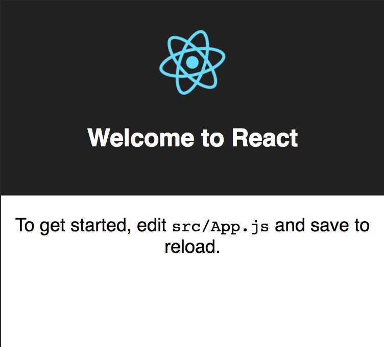

# Bird Snap

## Introduction

Here is a brief explanation of the tutorial

### Requirements
You will need
1. Node 8 or higher
2. npm 5.2 or higher

### Getting Started
Here is how to get started

```npm
npx create-react-app bird-snap
```


some more steps then:


