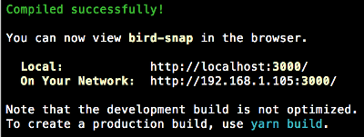

# Bird Snap

## Introduction

In this tutorial you will use the amazing *create-react-app* tool to initial and application,
then add several components to your react application. You will then use *redux* to 
manage teh state of the application.


### Requirements
You will need
1. Node 8 or higher
2. npm 5.2 or higher
3. yarn

### Getting Started
To create a new application simply run the command:

```npm
npx create-react-app bird-snap
```

This creates a fully configured application named *bird-snap* and downloads the various dependencies.
You can navigate to the root folder of your application with the command:

```npm
cd bird-snap
```

To see the application in action run:

```npm
yarn start
```

The application will start in a local server and open in your browser.


In the terminal you will see that the server is running and awaiting requests.


